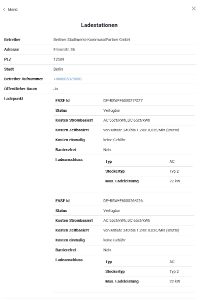

Masterportal Addon ComplexObject (gfiTheme)
======================================================
[Masterportal](https://bitbucket.org/geowerkstatt-hamburg/masterportal/src/dev/) ComplexObject Addon zur Verwendung in der "Digitale Plattform Stadtverkehr - Berlin"-Plattform.


Das Addon bietet die Möglichkeit im GFI-Fenster verschachtelte Datenstrukturen zu visualisieren, die sich nicht in der einfachen Tabellenstruktur des Default-Theme abbilden lassen.
Hierfür wurden die GFI-Attribute um die Typen Object und Array erweitert.

Das Plugin ist mit der Masterportal Version 3.5.1 getestet.

Das Addon im Einsatz kann in der [Digitalen Plattform Stadtverkehr Berlin](https://viz.berlin.de/site/_masterportal/e-infoplattform/) betrachtet werden.
Die dazu passende [Konfiguration](https://github.com/digitale-plattform-stadtverkehr-berlin/masterportal-dps-config/blob/master/resources/services-internet.json) steht ebenfalls zu Verfügung 


## Beispiel Konfiguration

```
    "gfiAttributes": {
      "operatorName": "Betreiber",
      "address": "Adresse",
      "plz": "PLZ",
      "city": "Stadt",
      "operatorHotline": "Betreiber Rufnummer",
      "oeffentlicherRaum": "Öffentlicher Raum",
      "beschilderungVorhanden": "Beschilderung vorhanden",
      "ladeSaeulen": {
        "type": "array",
        "name": "Ladepunkt",
        "elements": {
          "type": "object",
          "children": {
            "evseId": "EVSE Id",
            "status": "Status",
            "uebernutzungsgebuehrStrombasiert": "Kosten Strombasiert",
            "uebernutzungsgebuehrZeitbasiert": "Kosten Zeitbasiert",
            "uebernutzungsgebuehrEinmalig": "Kosten einmalig",
            "type": "Typ",
            "barrierefrei": "Barrierefrei",
            "ladeAnschluesse": {
              "type": "array",
              "name": "Ladeanschluss",
              "elements": {
                "type": "object",
                "children": {
                  "typ": "Typ",
                  "steckertyp": "Steckertyp",
                  "maxLadeleistungKw": {
                    "name": "Max. Ladeleistung",
                    "suffix": "kW"
                  }
                }
              }
            }
          }
        }
      }
    }
```
